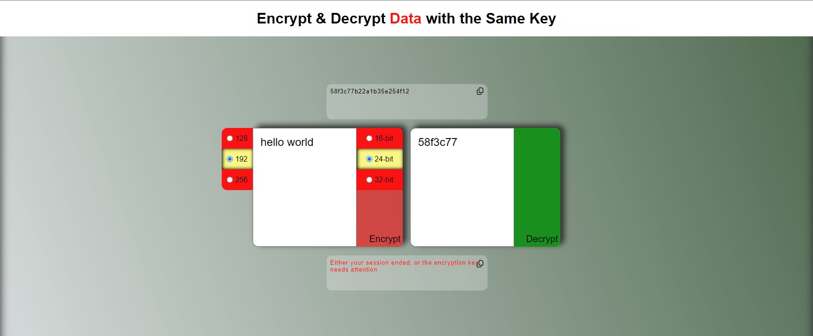
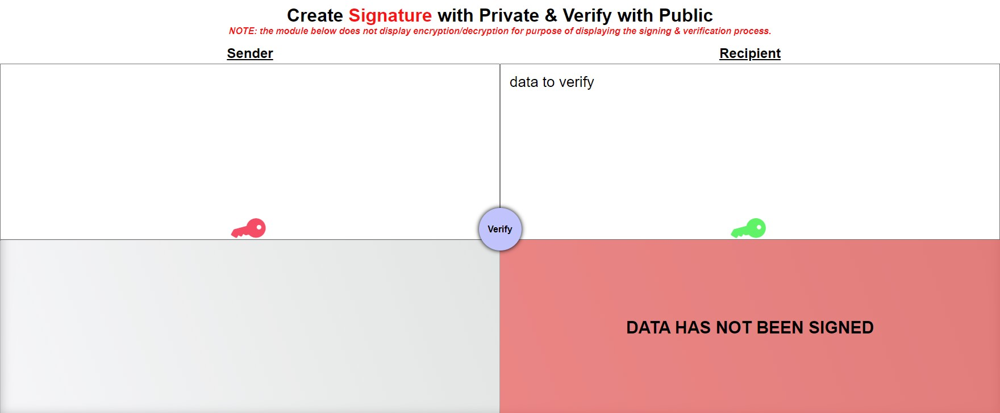
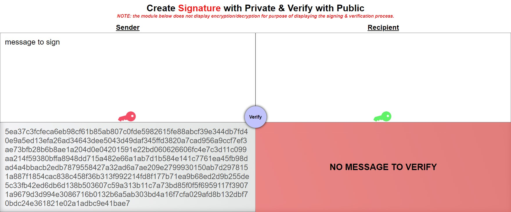

<h1 style='text-align:center;width:100%;color:#f00'>key-encryption-playground (KEP)</h1>

## Intro
Welcome to the KEP service where data is seen and unseen! This service explores Public Key Infrastructure (PKI) by simulating:
1) Key management on the server & client
2) Encryption/Decryption
3) Signing & testing the integrity of data
## Objectives
<div style='text-align:left;display:flex;flex-direction:column;align-items:center;justify-content:center;width:100%;font-size:18px'>
<ol style='display:flex;flex-direction:column;align-items:start;justify-content:center;width:100%;font-size:18px'>
<li>Distinction between a public & private keys</li>
<li>Distinction between the ecryption & signatures</li>
</ol>
</div>

## Generating Key pairs from a server
Require crypto & configure options regarding to setting up the public/private key infrastructure.<br>
Public & Priate Keys are generated from a function [ genKeys() ].<br>

**File location:** <em>./encryption/genKeys.js</em>
```
const crypto = require("crypto"),
  fs = require("fs"),
  modLen = 2048,
  type = "pkcs1", // public key cryptography standards 1
  type2 = "pkcs8", // private key cryptography standards 1
  format = "pem", // common formatting choice
  path = require('path')

const pubencodingOptions = {
  type,
  format,
};
const privencodingOptions = {
  type:type2,
  format,
};

function genKeys(){
  const keypair = crypto.generateKeyPairSync("rsa", {
    modulusLength: modLen,
    publicKeyEncoding: pubencodingOptions,
    privateKeyEncoding: privencodingOptions,
  });

  
  const pubname = "/id_rsa_pub.pem",
        privname = "/id_rsa_priv.pem",
        dir = "/crypto";
        
    // write files
    fs.writeFileSync(path.join(__dirname,dir,pubname), keypair.publicKey);
    fs.writeFileSync(path.join(__dirname,dir,privname), keypair.privateKey);
  }
  ```

When the server starts, 1 public key & 1 private key is generated for the entire server session.<br> It would not make sense to dynamically regenerate new keys during a server session because this practice can alter the trust & encryption of keys across all clients.<br>
**For Instance** <br><em>Think about the relationship between the myth of <b>Santa Claus</b> and the average <b>homeowner.</b> The common belief is that on Christmas Eve, 1 time a year, Santa would travel from home to home, sneaking in your chimney & dropping gifts for the whole family.<br>Now imagine <b>Santa</b> attempting the action on a random day of the year <b>without reindeer & presents</b><br> This would break the contract between Santa & the homeowner. Santa's <b>TRUST/INTEGRITY</b> will get tried in court for not following protocol & scaring kids on random days of the year.<br>In addition, this might not even be the real Santa. They can be a fraud/burgler who <b>ENCODED</b> themselves as santa, but was easily <b>DECODED</b> by the homeowner since the fraud did not come with presents or flying deer. Basically, the fraud-Santa gave the homeowner the keys to see through their criminal act.</em>
## Key pair importance
There is much significance when public/private key-pairs are generated together & not used outside of their bubble. Think of key-pairs as twins who connect on a mental-mathematical level. They can't think like this with anyone else except with their biological twin. One twin will assist in sign/encrypt process, and the other twin will assist verify/decrypt process. during the crutial moments of authentication & decryption, if one twin does not recognize the other, or not present, the operation can fail, maintaining the integrity & security of the data sent.
<div style="width:100%;text-align:center;"><h2>Symmetric Encryption</h2></div>
## Cipher & Decipher
<!-- one byte is equal to eight bits -->
Cipher, Decipher, Encoder, Decoder...call this whatever you like.
This module begins with generating a hashed-key with Hash-based message authentication code(HMAC) and converting to hex value.<br>
```
key = createHmac("sha256", process.env.SECRETY)
        .update('random secret message')
        .digest("hex")
```

After creating the key, we allocate the key's byte length when choosing between the different bytes **[16,24,32]**. <br>
The key is stored in the user's session for the purpose of **symmetric ecryption**.<br> In other words, the hashed-key is acting as the **public key**.<br>
<code>
req.session.key = Buffer.alloc(keylen, key)
</code><br>
Next, we create the **Initialization Vector**(IV), which adds cryptographic variance, making it much harder to crach the cipher.<br>
The IV changes everytime the user attempts to **ENCODE** a message in the module.<br>
<code>
iv = randomBytes(16);
</code><br>
Finally, we decide an algorithm, or an encryption standard that will fit our module's needs.<br>
Keep in mind that the decoder & encoder typically use the same algorithm when **creating a cipher and decipher**<br>
We are using algorithm **aes-[128,192,256]-gcm**<br>
<code>
`aes-${aes}-gcm`
</code><br>
**TIP** The encoder/decoder allows the clinet to choose different bit encryption **[128,192,256]** and the **number of bytes** that represents the key's length. If the byte length does not calculate properly in the the number of bits, an error is thrown.<br> 
**Rule of thumb** - <em>1 byte is equal to 8 bits</em>

**TIP** The acting public key must be the same, but the IV must change after decryption. This is the power of the IV when encrypting and decrypting a message.

<div style='text-align:center;display:flex;flex-direction:column;align-items:center;justify-content:center;width:100%;'>


<!-- createcipheriv -->

### Cipher is created above
The cipher is created with **crypto's** ```createCipheriv()``` function:<br>
<code>
const cipher = createCipheriv(`aes-${aes}-gcm`, req.session.key, iv)</code>

We pass 3 arguments: **Algorithm, Key & IV**<br>


<!-- createDecipheriv -->

### Decipher is created above
The cipher is created with **crypto's** ```createDecipheriv()``` function:<br>
<code>const decipher = createDecipheriv(`aes-${req.session.aes}-gcm`,
        Buffer.from(req.session.key),
        Buffer.from(iv))</code>

 We pass 3 arguments: **Algorithm, Key & IV**


### Symmetric encryption errors




<div style="width:100%;text-align:center;"><h2>Asymmetric Encryption</h2></div>


<div style="width:100%;text-align:center;"><h2>Signature & Verification</h2></div>





</div>