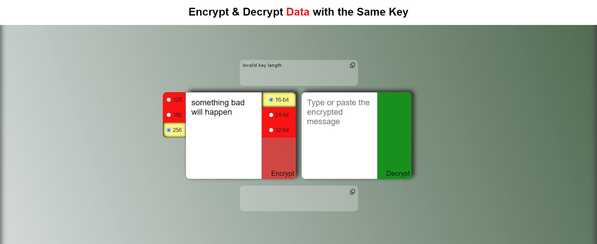
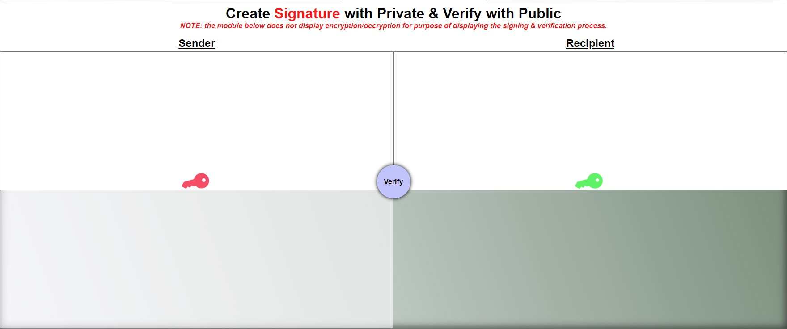
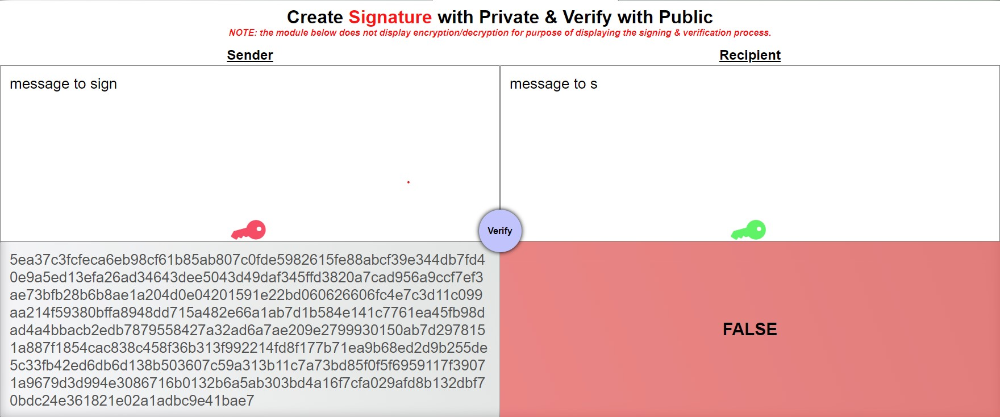

<h1 style='text-align:center;width:100%;color:#f00'>key-encryption-playground (KEP)</h1>

## Intro
Welcome to the KEP service where data is seen and unseen! This service explores Public Key Infrastructure (PKI) by simulating:
1) Key management on the server & client
2) Symmetric encryption (same key)
3) Asymmetric encryption (2 different keys)
4) Signing & verifying the integrity of data
## Objectives
<div style='text-align:left;display:flex;flex-direction:column;align-items:center;justify-content:center;width:100%;font-size:18px'>
<ol style='display:flex;flex-direction:column;align-items:start;justify-content:center;width:100%;font-size:18px'>
<li>Distinction between public & private keys</li>
<li>Distinction between the ecryption process & signature process</li>
</ol>
</div>

## Generating Key pairs from a server
Require crypto & configure options regarding to setting up the public/private key infrastructure.<br>
While there are a many ways to spawn Public & Priate Keys, our server generates keys from the function crypto.generateKeyPairSync.
At most, the arguments needed would be the modulus length, privateKeyEncoding options & publicKeyEncoding options.<br>

**File location:** <em>./encryption/genKeys.js</em>
```
const crypto = require("crypto"),
  fs = require("fs"),
  modLen = 2048,
  type = "pkcs1", // public key cryptography standards 1
  type2 = "pkcs8", // private key cryptography standards 1
  format = "pem", // common formatting choice
  path = require('path')

const pubencodingOptions = {
  type,
  format,
};
const privencodingOptions = {
  type:type2,
  format,
};

function genKeys(){
  const keypair = crypto.generateKeyPairSync("rsa", {
    modulusLength: modLen,
    publicKeyEncoding: pubencodingOptions,
    privateKeyEncoding: privencodingOptions,
  });

  
  const pubname = "/id_rsa_pub.pem",
        privname = "/id_rsa_priv.pem",
        dir = "/crypto";
        
    // write files
    fs.writeFileSync(path.join(__dirname,dir,pubname), keypair.publicKey);
    fs.writeFileSync(path.join(__dirname,dir,privname), keypair.privateKey);
  }
  ```

When the server starts, 1 public key & 1 private key is generated for the entire server session.<br> It would not make sense to dynamically regenerate new keys during a server session because this practice can alter the trust & encryption of keys across all clients.<br>
**For Instance** <br><em>Think about the relationship between the myth of <b>Santa Claus</b> and the average <b>homeowner.</b> The common belief is that on Christmas Eve, 1 time a year, Santa would travel from home to home, sneaking in your chimney & dropping gifts for the whole family.<br>Now imagine <b>Santa</b> attempting the action on a random day of the year <b>without reindeer & presents</b><br> This would break the contract between Santa & the homeowner. Santa's <b>TRUST/INTEGRITY</b> will get tried in court for not following protocol & scaring kids on random days of the year.<br>In addition, this might not even be the real Santa. They can be a fraud/burgler who <b>TAMPERED SANTA'S SIGNATURE</b>, but was <b>FALSLEY VERIFIED</b> by the homeowner since the fraud did not fit the role.They did not even come with presents or flying deer.</em>
## Key pair importance
There is much significance when public/private key-pairs are generated together & not used outside of their bubble. Think of key-pairs as twins who connect on a mental-mathematical level. They cannot think like this with anyone else except with their biological twin. One twin will assist in sign/encrypt process, and the other twin will assist verify/decrypt process. during the crutial moments of authentication & decryption, if one twin does not recognize the other, or not present, the operation can fail, maintaining the integrity & security of the data sent.
<div style="width:100%;text-align:center;"><h2>Symmetric Encryption</h2></div>

**Note**: While there are many symmetric encryption standards to choose from, this service will be working closely with the <b>Authentication Encryption Standard (AES)</b>.

## Cipher & Decipher
<!-- one byte is equal to eight bits -->
Cipher/Decipher, Encoder/Decoder, Encryptor/Decryptor...call this module what best suits your memory.
This module begins with generating a hashed-key with Hash-based message authentication code(HMAC) and converting to hex value.<br>
```
key = createHmac("sha256", process.env.SECRETY)
        .update('random secret message')
        .digest("hex")
```

After creating the key, we allocate the key's byte length when choosing between the different bytes **[16,24,32]**. <br>
The key is stored in the user's session for the purpose of **symmetric ecryption**.<br> In other words, the hashed-key is acting as the **public key**.<br>
<code>
req.session.key = Buffer.alloc(keylen, key)
</code><br>

Next, we create the **Initialization Vector**(IV), which adds cryptographic variance, making it a little more difficult to crack the cipher.<br>
The IV changes everytime the user attempts to **ENCODE** a message in the module.
Keep in mind that the IV does not need a size because the IV can decrease/increase it's size dynamically.<br>
<code>
iv = randomBytes(16);
</code><br>

Finally, we decide an algorithm, or an encryption standard that will fit our module's needs.<br>
Keep in mind that the decoder & encoder typically use the same algorithm when **creating a cipher and decipher**.<br>
We are using algorithm **aes-[128,192,256]-gcm**<br>
<code>
`aes-${aes}-gcm`
</code><br>

**TIP** The encoder/decoder allows the clinet to choose different bit encryption **[128,192,256]** and the **number of bytes** that represents the key's length. If the byte length does not calculate properly in the the number of bits, an error is thrown.<br> 
**Rule of thumb** - <em style='color:orange;'>1 byte is equal to 8 bits</em>

**TIP** While the acting public key is constant, the IV is expected to change after decryption completes. This is the power of the IV when encrypting and decrypting a message.

<div style='display:flex;flex-direction:column;align-items:center;justify-content:center;width:100%;'>


<!-- createcipheriv -->

### Cipher is created above
 We pass 3 arguments: **Algorithm, Key & IV**

The cipher is created with **crypto's** ```createCipheriv()``` function:<br>
<code>
const cipher = createCipheriv(`aes-${aes}-gcm`, req.session.key, iv)</code><br>
After creating the encrypted message in the server, the message is sent back to the client.


<!-- createDecipheriv -->

### Decipher is created above
 We pass 3 arguments: **Algorithm, Key & IV**

The cipher is created with **crypto's** ```createDecipheriv()``` function:<br>
<code>const decipher = createDecipheriv(`aes-${req.session.aes}-gcm`,
        Buffer.from(req.session.key),
        Buffer.from(iv))</code><br>
        After decrypting the encrypted message in the server, the result/message is sent back to the client.

### Symmetric encryption errors


Since the key & the Initialization Vector (IV) are known between the encoder & decoder, sending messages should be a breeze, however there are few conditions that need to be met:

**AES Bit length : Byte length ratio**<br>
Remember the rule of thumb from earlier? [ **Rule of thumb** - <em style='color:orange;'>1 byte is equal to 8 bits</em> ]<br>
The **key size** refers to the **number of transformation rounds** that encrypt the data(payload).
If the key's length is too short or too long for the standard, an <em style='text-decoration:underline;'>Invalid key length</em> error is displayed.<br>
128-bit keys | 16 bytes | 12 rounds<br>
192-bit keys | 24 bytes | 14 rounds<br>
256-bit keys | 32 bytes | 16 rounds<br>

**The encrypted message is not altered before decryption**<br>
This error occurs if the encrypted message does not match the intended encryption output.

**Active client-session**<br>
This error is application specific in that the user's cookie-session expired after **60000 (60) seconds**. If a message was encrypted before client session expires, the encrypted value will fail decryption because each user-session stores the ```req.session.key``` value to pass onto the decrypt api, so upon expiration, the user's session-object ends & respawns under a **new id**. The id is based off of the current time ```new Date()``` & ciphered with aes-256 bit encryption. Since both key & IV is required to decipher the encrypted user's id, both properties are set to randomly generated bytes. There is no database involved to track users.

<div style="width:100%;text-align:center;"><h2>Asymmetric Encryption</h2></div>

Asymmetric can be described as:<br>
- <em>A key that fits a keyhole</em><br>
- <em>A missing piece to a puzzle</em><br>
- <em>5 firebenders required to open Avatar Roku's gnarly, metal door.</em><br>

- <em>The Yin & Yang Koi-fish that swim in the pond of the Northern Water Tribe</em><br>


Asymmetric Encryption, or Public Key Encryption takes place with a generated key pair, like we talked about above, & linking the keys together to decrypt the message.<br>Without confusion, asymmetric encryption differs from Signing and verifying data in that **Data is encrypted with a public Key & Decrypted with a private key**. <br>
## Encrypt with Public Key


The module above displays one of the basic usees of a postal service. A message is created & dropped in the mail. After the mail is dropped, it transforms into encrypted data thanks to the **mailbox entry bin** or the public key.

```
const message = req.body.message;
  try {
    if (message) {
      // buffer the message
      const buffer = Buffer.from(message)
      // encrypt data
      let encryptedData = crypto.publicEncrypt(
        pubKey,
        buffer
      );
      // convert encrypted data to hex
      let encData = encryptedData.toString('hex')
      // return json encrypted data
      res.json({
        message: encData,
      });
    } else {
      console.log(message);
      res.json({ message: undefined });
    }
  } catch (err) {
    throw new Error(err);
  }
  ```

  ## Decrypt with Private Key


After encryption is complete, the postal worker will unlock the mailbox with their **metal key** (private key). The messanger's key seems to **fit perfectly** with the public key, therefore given them the ability to decrypt the mail.

```
const message = req.params.message;
  console.log(message)
  try {
    if (message) {
      // buffer the hex data from encrypted message
      const buffer = Buffer.from(message,'hex')
      // decrypt data with private key 
      let decData = crypto.privateDecrypt(
        privKey,
        buffer
      );
      // send decrypted data
      res.json({ message: decData.toString('utf-8') });
    } else {
      res.json({ message: undefined });
    }
  } catch (err) {
    throw new Error(err);
  }
```
<div style="width:100%;text-align:center;"><h2>Signature & Verification</h2></div>

### Signatures, or Digital Signatures, is another layer of security with 2 conditions:<br>
Data is expected to be **1) transmitted with integrity** by the source &
**2) properly verified** by the destination.<br>
During the signing process, a sign is created with **rsa-sha256**, or a hash. Next, the sign is updated with the message (or encrypted message). Finally the sign, <em>signs</em> the data with the private key.




The module above displays a sender signing [**not encrypting**] their message with a **private key** to prove that the message came from them.

```
 const message = req.params.message
  
  try{
    if(message){
      let sign = createSign('rsa-sha256')
      sign.update(message)
      let signature = sign.sign(privKey,'hex')
      console.log(signature)
      res.json({message:signature})
    }
  } 
  catch(err){
    throw new Error(err)
  }
```


The module above displays a recipient verifying [**not decrypting**] their message with a **public key** to ensure the message maintains its integrity.

### Signature/Verification errors



The module above displays how data is **tampered** after verifying with a public key. In other words, the data cannot be trusted.

```
const {plain} = req.body
  const {signature} = req.params
  try{
    if(signature){
      // ensure data is not tampered
    const verify = createVerify('rsa-sha256')
    verify.update(plain)
    const isVerified = verify.verify(pubKey,signature,'hex')
    console.log(isVerified)
    res.json({bool:isVerified})
  }
  } 
  catch(err){
    throw new Error(err)
  }
```


The module above displays how data has **not been signed**


The module above displays how the client requires **message/payload** to sign or update.
</div>

### Conclusion
In conclusion, the goal of this service is to break down the differences & uses between symmetric/asymmetric encryption, as well as the differences between encryption & signatures. 
I am confident that the more this service is used, the faster the understanding will set in.

Enjoy